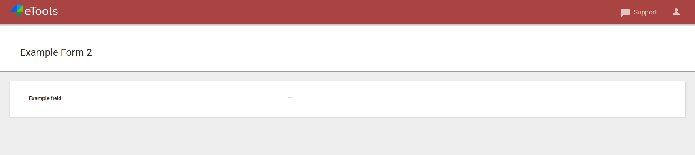

Blueprint
=========

Blueprint is template which contains all required information to display form.

Main parts of each form are:

- Code (should be unique, used to update form in olc)
- Title
- Nested form elements structure
- Metadata

let's create simple form with just one field available

.. code-block:: python

	example_form = Blueprint('example_form', 'Example form')
	example_form.add(
        Group(
            'group_1',
            TextField('name', label='Example field', required=True),
            title='Group 1',
            styling=['card']
        )
    )
	print(json.dumps(example_form.to_dict(), indent=2))

	>> {
	>>     "code": "example_form",
	>>     "title": "Example form",
	>>     "structure": {
	>>         "type": "group",
	>>         "extra": {},
	>>         "styling": [
	>>             "abstract"
	>>         ],
	>>         "name": "root",
	>>         "repeatable": false,
	>>         "required": true,
	>>         "title": null,
	>>         "children": [
	>>             <elements structure>
	>>         ]
	>>     },
	>>     "metadata": {
	>>         "options": {},
	>>         "validations": {},
	>>         "offline_enabled": true,
	>>         "allow_multiple_responses": true
	>>     }
	>> }

