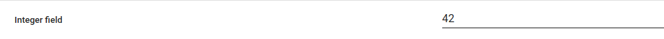
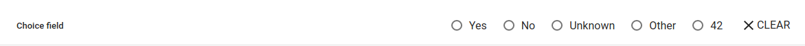
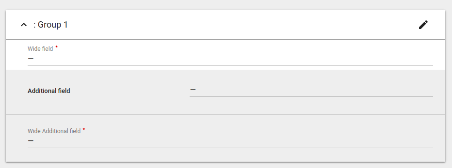

Fields
======

in general every field has next attributes:

- name
- label
- required
- default_value
- placeholder *not implemented on frontend*
- help_text
- repeatable *not implemented on frontend*
- extra
- styling

repeatable - usually used for multi-selection with choices. in this case list of values will be submitted
extra - very specific information in any type. can be used to make special fields. will be provided into json form structure as is
styling - see `Field styling` section

example of field with help text:

.. code-block:: python

    TextField(
        'text_field', 
        label='Text field', 
        help_text='Some text to provide additional information about field'
    )

Simple typed fields
-------------------

value is validated to match field type

TextField
_________

value converted to string during validation

.. code-block:: python

    TextField('text_field', label='Text field')

IntegerField
____________

accept only integer values. *field type is incorrect on frontend, i can type float*

.. code-block:: python

    IntegerField('integer_field', label='Integer field')

FloatField
__________

accept float numbers. can accept text if valid number contained inside

.. code-block:: python

    FloatField('float_field', label='Float field')

BooleanField
____________

*not implemented on frontend actually, workaround is to use choicefield with boolean values*

.. code-block:: python

    ChoiceField('boolean_field', label='Boolean choice field', options_key='boolean')

    example_form.metadata.options['boolean'] = LocalPairsOptions([
        {'value': True, 'label': 'Yes'},
        {'value': False, 'label': 'No'},
    ])

Likert Scale (ChoiceField)
--------------------------

likert scale has pre-defined options. they should be defined in metadata, whilst only key for them is provided to field. values can be in any type.

.. code-block:: python

    ChoiceField('choice_field', label='Choice field', options_key='example_options_key')

    example_form.metadata.options['example_options_key'] = LocalPairsOptions([
        {'value': True, 'label': 'Yes'},
        {'value': False, 'label': 'No'},
        {'value': None, 'label': 'Unknown'},
        {'value': 'other', 'label': 'Other'},
        {'value': 42, 'label': '42'},
    ])

Options for likert scale
------------------------

Options can be defined in multiple ways, depending from level of control and frequency of changes

LocalFlatOptions
________________

*not implemented on frontend*
values will be displayed to user as it is

.. code-block:: python

    LocalFlatOptions(['one', 'two', 'three'])

LocalPairsOptions
_________________

value and displayed label should be specified for every option

.. code-block:: python

    LocalPairsOptions([
        {'value': 1, 'label': 'One'}, 
        {'value': 2, 'label': 'Two'}, 
        {'value': 3, 'label': 'Many'}
    ])

RemoteOptions
_____________

options fetched from remote url. should be used when options updated frequently and couldn't be provided in form. if url require authentication, auth_required flag should be used to give more context to the frontend.
*not implemented on frontend*
*field validation not implemented on backend*

.. code-block:: python

    RemoteOptions('example.com')

File fields
-----------

UploadedFileField
_________________

file field designed to be used in etools to reuse forms framework for online. accept attachment id as value

RemoteFileField
_______________

accept file as url to be downloaded. on save attachment is created and separated task delayed to download attached file from link. there is no special mechanism to resolve bad urls, those issues should be fixed manually.

MixedUploadedRemoteFileField
____________________________

combine both fields above. when 'http' is provided in value, act as RemoteFileField else as UploadedFileField. it means, MixedUploadedRemoteFileField can be used everywhere when file input is needed

*not implemented on frontend as separate field, works only with floated_attachment group inside collapse card group. file_type is hardcoded on frontend, so also required*

.. code-block:: python

    Group(
        'group_1',
        TextField('text_field', label='Text field'),
        Group(
            'attachments',
            MixedUploadedRemoteFileField('attachment'),
            ChoiceField('file_type', options_key='target_attachments_file_types'),
            required=False, repeatable=True,
            styling=['floating_attachments'],
        ),
        title='Group 1',
        styling=['card', 'collapse']
    )

    blueprint.metadata.options['target_attachments_file_types'] = LocalPairsOptions(
        list(FileType.objects.filter(code='fm_common').values_list('id', 'label'))
    )

.. image:: _static/images/field-file-group.png
.. image:: _static/images/field-file-popup.png

Fields validations
------------------

fields are validated both on backend and frontend. like options, validations are initialized in metadata and then just keys are defined in field

.. code-block:: python

    TextField(phone_'number', validations=['phone_regex'])

    contact_book.metadata.validations['phone_regex'] = RegexTextValidation(r'\d{7}')

text validations:

- MaxLengthTextValidation
- RegexTextValidation

number validations:

- LessThanValidation
- GreaterThanValidation

Fields styling
--------------

currently implemented styling options for fields:

- wide - fill width field instead of half
- additional - field will be grey

.. code-block:: python

    TextField('wide_field', label='Wide field', styling=['wide'])
    TextField('additional_field', label='Wide Additional field', styling=['wide', 'additional'])

