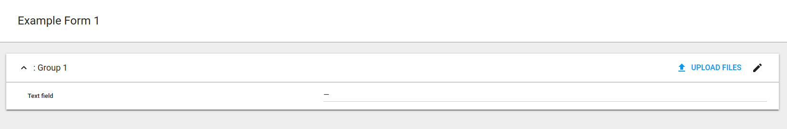
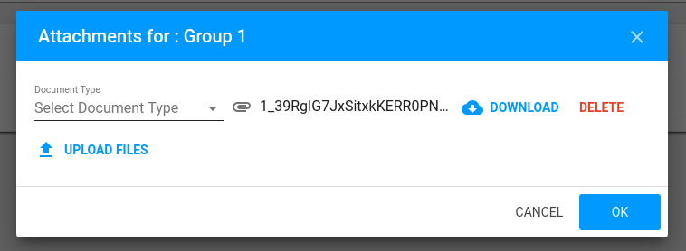

Groups
======

group is just container for another form elements. think about them as structures.

.. code-block:: python

    Group(
        'phone',
        TextField('number', required=True, validations=['phone_regex']),
        TextField('type', required=False),
        required=True, title='Phone',
    )

valid data for those group will be 

.. code-block:: json

    {
        "number": "1234567", "type": "mobile"
    }

group attributes:

- name
- title
- required
- repeatable *not implemented on frontend*
- extra - same as for fields
- styling - same as for fields

repeatable group can handle list of structures in responses. for example we can tweak previous code to save multiple phones instead of just one

.. code-block:: python

   Group(
        'phones',
        TextField('number', required=True, validations=['phone_regex']),
        TextField('type', required=False),
        required=True, title='Phones', 
        repeatable=True
    )

.. code-block:: json

    [
        {"number": "1234567", "type": "mobile"},
        {"number": "2234567", "type": "home"},
        {"number": "3234567"}
    ]

Styling
-------

same as for fields. implemented styling options:

abstract
________

group itself will not be displayed as separate element. can be used to join fields into logical structure

.. code-block:: python

    Group(
        'group_1',
        Group(
            'group_2',
            TextField('grouped_field_1'),
            TextField('grouped_field_2'),
            styling=['abstract'],
        ),
        TextField('outer_field'),
        title='Group 1',
        styling=['card']
    )

first two fields are inside group_2, but user see no difference between them and third one.

card
____

group will be displayed as card. groups can be nested

.. code-block:: python

    Group(
        'group_1',
        TextField('text field'),
        title='Group 1',
        styling=['card']
    )

*TODO: update screenshot after title implementation*

collapse
________

to be used with *card* modifier. allow group to be collapsed

.. code-block:: python

    Group(
        'group_1',
        TextField('text field'),
        title='Group 1',
        styling=['card', 'collapse']
    )

*TODO: update screenshot after title suffix removing*

floating_attachments
____________________

allow files uploading from popup using top right button. should be contained inside card

.. code-block:: python

    Group(
        'group_1',
        TextField('text_field', label='Text field'),
        Group(
            'attachments',
            MixedUploadedRemoteFileField('attachment'),
            ChoiceField('file_type', options_key='target_attachments_file_types'),
            required=False, repeatable=True,
            styling=['floating_attachments'],
        ),
        title='Group 1',
        styling=['card', 'collapse']
    )

    blueprint.metadata.options['target_attachments_file_types'] = LocalPairsOptions(
        list(FileType.objects.filter(code='fm_common').values_list('id', 'label'))
    )

Group validations
------------------

group validations can be supplied, but none of them already implemented neither on backend nor frontend. for more information check similar article in fields
